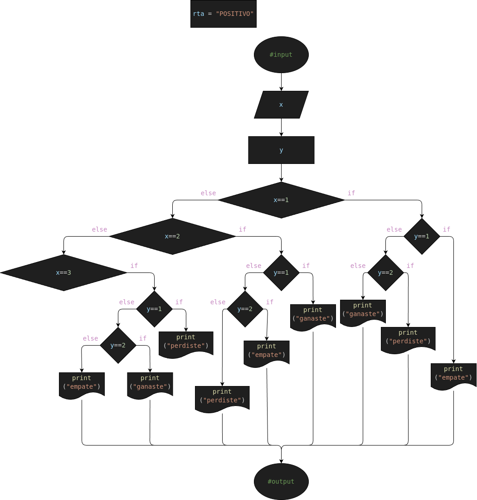

# Ejercicio #1: rock_paper_scissors

Programa para jugar al Piedra Papel o Tijeras pero en la terminal

## Analisis

### Variable de entrada
- 1.= Piedra
- 2.= Papel
- 3.= Tijeras

### Procesamiento

- $ print("Resultados") $
- $ if User == 1: $
-     if Machine == 1:
-         print("✊​ / ✊​")
-         print("Empate")
-     elif Machine == 2:
-         print("✊​ / ✋​")
-         print("Perdiste")
-     else:
-         print("✊ / ✌️​")
-         print("Ganaste")
- elif User == 2:
-     if Machine == 1:
-        print("✋ / ✊​​")
-         print("Ganaste")
-     elif Machine == 2:
-         print("✋ / ✋​")
-         print("Empate")
-     else:
-         print("✋ / ✌️​")
-         print("Perdiste")
- elif User == 3:
-     if Machine == 1:
-         print("✌️​ / ✊​")
-         print("Perdiste")
-     elif Machine == 2:
-         print("✌️ / ✋​​")
-         print("Ganaste")
-     else:
-         print("✌️ / ✌️​​")
-         print("Empate")
- else:
-     print("ERROR!: Elección no valida")
-     exit()

### Variable de salida
- Es Positivo
- Es Negativo

## Diseño

## Construccion

- Codigo implementado en el archivo "positive_number.py"rock_paper_scissors